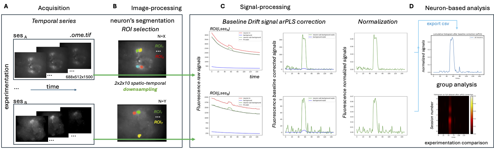

# the CALIM project (**CAL**cium **IM**aging pipeline analysis)

We propose a semi-automated post-processing pipeline (Figure below), developed in Python, dedicated to the analysis of time series from calcium microscopy. The steps of this pipeline are as follows:

Each experiment, which may include multiple time series sessions (2D+t) acquired at the native spatial resolution of 688×512×1500, was exported in the OME-TIFF format (Figure A).
Manual segmentation of regions of interest (ROIs) was performed in Fiji by an expert (EC), at native resolution, based on dynamic navigation through a sliding window across the time series and on contrast differences observed in the 2D maximum intensity projection (MIP) image. The segmentation masks of the neurons (Figure B) were then delineated using labeled, closed polygons and exported in Fiji format (Rois.zip). Each session was subsequently downsampled by a factor of 2×2×10 (via linear interpolation) to reduce noise, and the ROIs were propagated to the resized image stack.
For each session and each ROI, the temporal signal (green curve) underwent drift correction using arPLS [Baek2015] in two sub-steps. First, the background signal was estimated from 10% of randomly selected pixels in the image (blue curve in Figure C). Second, this estimated background signal was subtracted from the raw signal extracted from the ROI (red curve). The resulting baseline-corrected signal is shown in Figure C and was subsequently normalized (considering all ROIs from a given session; green curve).

Finally, the average histogram of all sessions from each experiment (Figure D), along with a heat map representation, was exported in CSV format for comparative analysis across experiments.

It should be noted that temporal smoothing of the signal was performed at two levels: (i) an explicit temporal reduction through local averaging over blocks of 10 consecutive frames, which reduced rapid non-neuronal fluctuations; and (ii) an adaptive baseline correction using the arPLS algorithm [Baek2015], which fits a smooth function to the slow components of the signal by asymmetrically weighting transient points. The regularization parameter (λ = 10) was chosen to preserve transients of interest while effectively eliminating long-term drifts caused by background noise or photobleaching.



## Installation

### Clone the repository:
```bash
$ git clone https://github.com/arnaudletroter/CALIM.git
```
### (Optional but recommended) Create a virtual environment:
conda create --name CALIM 
conda activate CALIM

### Install dependencies:
```bash
$ pip install -r requirements.txt
```

### Exemple Input Dataset organization
```bash
└── 04-04-23
    ├── 230404_5
    │   ├── 230404_5_MMStack_Pos0_metadata.txt
    │   ├── 230404_5_MMStack_Pos0.ome.tif
    │   ├── ROIs
    │   │   └── ROIs.zip
    └── 230404_9
        ├── 230404_9_MMStack_Pos0_metadata.txt
        ├── 230404_9_MMStack_Pos0.ome.tif
        ├── ROIs
        │   └── ROIs.zip
```

### Usage
```bash
$ jupyter-notebook calim_analysis.ipynb
```

### Exemple Output Dataset organization
```bash
├── 04-04-23
│   ├── 230404_5
│   │   ├── 230404_5_mask_arpls_clean_1.png
│   │   ├── 230404_5_mask_arpls_clean_2.png
│   │   ├── 230404_5_mask_arpls_clean_3.png
│   │   ├── 230404_5_mask_arpls_NORM_1.png
│   │   ├── 230404_5_mask_arpls_NORM_2.png
│   │   ├── 230404_5_mask_arpls_NORM_3.png
│   │   ├── 230404_5_mask1.png
│   │   ├── 230404_5_mask2.png
│   │   ├── 230404_5_mask3.png
│   │   ├── 230404_5_MMStack_Pos0_metadata.txt
│   │   ├── 230404_5_MMStack_Pos0.ome.tif
│   │   ├── ROIs
│   │   │   └── ROIs.zip
│   └── 230404_9
│       ├── 230404_9_mask_arpls_clean_1.png
│       ├── 230404_9_mask_arpls_clean_2.png
│       ├── 230404_9_mask_arpls_clean_3.png
│       ├── 230404_9_mask_arpls_clean_4.png
│       ├── 230404_9_mask_arpls_NORM_1.png
│       ├── 230404_9_mask_arpls_NORM_2.png
│       ├── 230404_9_mask_arpls_NORM_3.png
│       ├── 230404_9_mask_arpls_NORM_4.png
│       ├── 230404_9_mask1.png
│       ├── 230404_9_mask2.png
│       ├── 230404_9_mask3.png
│       ├── 230404_9_mask4.png
│       ├── 230404_9_MMStack_Pos0_metadata.txt
│       ├── 230404_9_MMStack_Pos0.ome.tif
│       ├── ROIs
│       │   └── ROIs.zip
├── heatmap.pdf
├── hist_cum.pdf
├── results_norm.csv
└── results_raw.csv
```

## REFERENCES

[Baek2015] Sung-June Baek, Aaron Park, Young-Jin Ahn, and Jaebum Choo. Baseline correction using asymmetri-
cally reweighted penalized least squares smoothing. Analyst, 140(1):250–257, 2015.